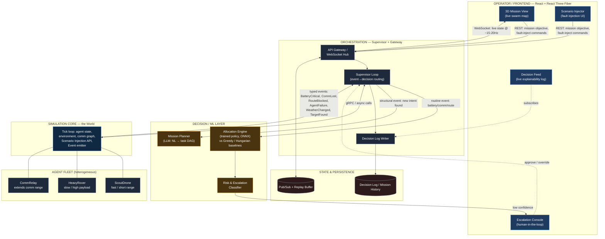

# AEGIS — Autonomous Swarm Mission Orchestration Platform
### System Architecture & Build Plan — EL-05: AI-Powered Autonomous Robot & Drone Swarm Mission Orchestration
### ELEVATE 1.0 — DJ Sanghvi College of Engineering

---

## 0. How to use this document

This doc is written for two readers:
1. **Opus 5.5 (this doc's author)** — captures every architectural decision and why.
2. **Sonnet 5 (the builder)** — Section 5 (Build Plan) is the literal execution order. Don't improvise structure; follow the phases. Sections 1–4 are the reference you pull from while implementing each phase.

Project name: **AEGIS** (Autonomous Execution & Guidance Intelligence System). Use this as the repo name, service prefixes, and PPT title.

---

## 0.5 System Architecture Diagram



**Read this diagram top-to-bottom as the decision path, bottom-to-top as the event path:** a fault/event is born in the Simulation Core (L4), rises through the Supervisor (L2) which routes it to either the fast Allocator or the slow LLM Planner (L3), produces a Decision Log entry, and the result streams back up to the Cockpit (L1) in under a second. The judge's "break it live" click at the top travels the same path in reverse.

This same diagram, restyled, is also what the §4 Gemini prompt below produces as a polished graphic for the PPT — use this Mermaid version for the engineering build reference, the Gemini render for the slide.

---

## 1. PRD → System Mapping (traceability)

Every line of the official problem statement is mapped to a concrete module below. This table is what slide 2 and slide 3 of the PPT are built from — it's the "we are doing everything the PRD asked" proof.

| PRD Requirement (verbatim intent) | System Component | Where it lives |
|---|---|---|
| Accept high-level mission objective in NL, decompose into tasks, dependencies, priorities, executable plan | **Mission Planner Agent** (LLM-based hierarchical decomposer) | `services/planner` (Python) |
| Determine which agent performs which task, sequencing, routing, energy/payload/comm/risk management | **Allocation Engine** — trained assignment policy + constraint solver | `services/allocator` (Python, PyTorch → ONNX) |
| Continuously monitor swarm + environment state, dynamically re-plan on new info/events | **Supervisor Loop** — closed-loop re-evaluation at fixed tick rate | `services/orchestrator` (Go) |
| Handle: high-priority target found, comm loss, blocked route, weather, battery critical | **Event-Driven Replanning Triggers** — typed event bus consumed by Supervisor | `services/orchestrator/events` (Go) + `services/sim-core` (Rust) |
| Reason about limited comm / uncertainty — what's important enough to transmit | **Comm-Aware Priority Queue** — bandwidth-budgeted message scheduler | `services/sim-core/comms.rs` |
| Determine mission-infeasibility, escalate to human when autonomous confidence is low | **Risk & Escalation Model** (trained confidence classifier) + **Human-in-the-Loop Console** | `services/allocator/risk_model.py` + `frontend/src/panels/Escalation.tsx` |
| Demo: ≥3 heterogeneous agents (drones, rovers, comm relays) with distinct capabilities/constraints | **Agent Capability Registry** + heterogeneous agent types in sim | `services/sim-core/agents.rs` |
| Demo: dynamic task allocation, reassignment, scheduling, routing, resource mgmt as conditions change | Allocation Engine + Orchestrator reassignment loop, visualized live | end-to-end |
| Demo: real-time re-planning for multiple failure/disruption scenarios | **Scenario Injector** — judge-triggerable fault injection panel | `frontend/src/panels/ScenarioInjector.tsx` → `sim-core` event API |
| Present autonomy/decision layer: comm prioritization, risk/feasibility assessment, human escalation, explanations for major decisions | **Decision Log & Explainability Stream** — every autonomous decision emits a structured, human-readable reason | `services/orchestrator/decisionlog.go` + Postgres `decision_log` table + `frontend/src/panels/DecisionFeed.tsx` |

**Explicit scope boundary (per PRD):** we are NOT solving isolated capability problems (object detection, SLAM, obstacle avoidance) — those are abstracted as sensor/capability stubs in the simulator. The system's job is mission-level reasoning and swarm coordination on top of those capabilities. Say this out loud in the demo — it's exactly what the brief asks for and most teams will get distracted building a detection model instead.

---

## 2. Why a polyglot stack (not "one framework for everything")

Throwing Python at every layer is the single biggest reason hackathon "real-time" demos stutter on stage. Each language here is chosen because it is the *fastest tool available for that specific job* — this is also a direct, defensible answer if a judge asks "why 4 languages, isn't that overkill":

| Layer | Language | Why this language specifically | Reference precedent |
|---|---|---|---|
| Simulation core (physics tick, agent state, event generation) | **Rust** | Deterministic sub-ms tick loop, no GC pauses, safe concurrency across hundreds of agent updates per tick. This is the layer that must never stutter — it's the "world." | Production RL/sim engines (e.g. Tricked) run the hot simulation loop in Rust with Python only orchestrating from outside |
| ML — allocation policy training, risk/escalation model training | **Python (PyTorch)** | Best-in-class ML tooling, fast iteration for training the assignment/risk models. Training happens offline, not on the hot path. | Standard — MAPPO/QMIX swarm RL projects (e.g. droneswarm, Dashing for the Golden Snitch) train in Python/PyTorch |
| ML — trained model inference at runtime | **ONNX Runtime**, called from Go orchestrator | Avoids paying Python's GIL/interpreter cost on the decision hot path; a trained PyTorch policy exports to ONNX and runs in single-digit milliseconds from Go or Rust | Standard production pattern for shipping trained policies outside Python |
| Mission planning (NL → task DAG) & Supervisor replanning trigger logic | **Python** (LLM-calling service, cold path — only runs on mission start / major replan events, not every tick) | LLM orchestration libraries are Python-native; this path tolerates ~1-3s latency since it only fires on replanning events, not every frame | Mirrors TACOS (Coordinator/Supervisor LLM hierarchy) and race-condition's Planner/Simulator agent split |
| Orchestrator / API gateway / WebSocket hub / event bus consumer | **Go** | Goroutines give cheap concurrency for hundreds of simultaneous agent-state streams + WebSocket fan-out to the frontend with predictable low latency; this is the layer judges' live interactions hit directly | Exactly the pattern in production polyglot systems: Go handles gateway + WS hub + orchestration while Python/Rust do the heavy lifting underneath (seen across Thales, race-condition, Proximus architectures) |
| Frontend — 3D visualization | **TypeScript + React + React Three Fiber (Three.js) + Zustand** | R3F is the fastest path to a serious-looking 3D mission view in a browser on a laptop, no engine install required | — |
| State fan-out / pub-sub | **Redis (Streams + Pub/Sub)** | Sub-millisecond fan-out from orchestrator to any number of WebSocket connections; also gives you a cheap "replay last N ticks" for demo safety (see §4.6) | Used identically in race-condition (Redis for state/pub-sub fanout) and Thales (Redis Streams event bus) |
| Persistence — mission history, decision log, agent profiles | **PostgreSQL** | Structured, queryable audit trail — directly satisfies the PRD's "traceability for major autonomous decisions" requirement | — |

**The one-sentence pitch for this choice (put it on slide 3):** *"Each layer runs in the language built for its job — Rust for a tick-perfect simulation core, Python for training and language-model reasoning, Go for high-concurrency real-time orchestration, and ONNX for running the trained policy without Python's runtime cost in the decision loop — so the system stays real-time under load instead of degrading like a single-language stack would."*

---

## 3. Detailed Module Breakdown

### 3.1 `sim-core` (Rust) — the World

Responsibilities:
- Owns ground-truth state: every agent's position, battery %, payload, comm range, health status, assigned task.
- Runs a fixed-tick simulation loop (target: 30 Hz authoritative tick, configurable).
- Models the environment: terrain/obstacle graph, no-fly/blocked zones, weather state (affects comm range + battery drain rate), communication graph (who can hear whom, computed from position + range + obstruction).
- Emits a typed event stream over gRPC when state-changing things happen: `AgentBatteryCritical`, `AgentCommLost`, `AgentFailure`, `RouteBlocked`, `WeatherChanged`, `HighPriorityTargetFound`. These events are what the Orchestrator's Supervisor Loop listens for.
- Exposes a **Scenario Injection API** — the judge-facing "break it live" control surface. Every fault the PRD lists (battery depletion, comm loss, blocked route, agent failure, weather change) is a single gRPC call this API accepts, so the frontend's "Inject Fault" button is a thin wrapper.
- Agent types (heterogeneous, per PRD's "≥3 heterogeneous agents" requirement): `ScoutDrone` (fast, short range, camera payload, low battery capacity), `HeavyRover` (slow, high payload capacity, long battery life, ground-only), `CommRelay` (stationary or slow-moving, extends comm range for nearby agents — this is the one that makes "reposition communication assets" from the PRD demoable).

Interface: gRPC server, Protobuf-defined (`proto/sim.proto`). Go orchestrator is the only direct client.

### 3.2 `allocator` (Python → ONNX) — the Brain's fast reflex

Responsibilities:
- **Training time:** a PPO-based (or simpler GA/heuristic-benchmarked, see §3.2.1) assignment policy trained against `sim-core` run headless at high speed (thousands of episodes/hour, no rendering). Trains on: agent capability vectors, task requirements, current swarm state, environment state → outputs task-to-agent assignment + route.
- **A trained risk/escalation classifier**: given a candidate plan + current confidence signals (comm quality, battery margin, obstacle density, policy entropy), outputs a `risk_score` and `should_escalate_to_human` boolean. This is what satisfies "escalate when autonomous confidence is insufficient."
- **Inference time:** both models exported to ONNX, loaded directly by the Go orchestrator via `onnxruntime-go` — no live Python process in the per-tick decision path. Python only runs for training and for the Mission Planner's LLM calls (see 3.3).

#### 3.2.1 What "real training, not pretrained" means here — be ready to defend this in Q&A
- Baseline 1: greedy nearest-agent assignment (naive).
- Baseline 2: Hungarian-algorithm optimal static assignment (classic OR, no learning).
- Our policy: PPO-trained assignment network that additionally accounts for *predicted future state* (battery trajectory, comm degradation) — something the static baselines can't do.
- **Show all three live, side-by-side, on the same disruption scenario**, with a metric (mission completion %, time-to-complete, agents lost) — this is your "we trained something real and it measurably beats the naive approach" moment, and it's a genuinely trainable, reproducible pipeline (precedented directly by PPO-GNN humanitarian routing and RL ambulance-dispatch projects — same shape of problem).

### 3.3 `planner` (Python, LLM-based) — the Brain's slow reasoning

Responsibilities, modeled directly on the TACOS Coordinator/Supervisor pattern:
- **Coordinator**: takes the operator's natural-language mission objective ("locate and tag survivors in sector 7, prioritize high ground") + current swarm/environment state → produces a structured task DAG (JSON: tasks, dependencies, priority, required capabilities).
- **Replanning trigger**: the Go orchestrator calls the Coordinator again (not the fast allocator) when a *structural* mission-level event occurs — e.g. "high priority target found" changes the mission intent, not just the assignment. Routine events (battery/comm/route) are handled by the fast Allocator without going back to the LLM — this split is what keeps replanning fast (sub-second) instead of waiting on an LLM call every tick.
- Runs as a FastAPI service, called by Go orchestrator over REST/gRPC, typically <2s latency, acceptable since it's only invoked on mission start and major re-intent events.

### 3.4 `orchestrator` (Go) — the Nervous System

Responsibilities:
- API Gateway: receives mission objective from frontend, REST + WebSocket.
- Calls `planner` once per mission / major replan to get the task DAG.
- Runs the **Supervisor Loop**: subscribes to `sim-core`'s event stream (gRPC stream), and on every event decides: (a) handle via fast Allocator (ONNX inference, <10ms), or (b) escalate to `planner` for a structural replan, or (c) escalate to the human operator via the Decision Log + Escalation panel.
- Maintains the **Decision Log**: every autonomous decision (assignment, reassignment, escalation) is written as a structured row — `{timestamp, trigger_event, decision, reasoning_text, confidence_score, escalated:boolean}` — to Postgres, and streamed live to the frontend's Decision Feed panel. This is the literal implementation of the PRD's "explanations for major autonomous decisions."
- WebSocket Hub: broadcasts swarm state at a high tick rate (target 20 Hz to the browser — the sim runs at 30 Hz but doesn't need to push every tick) to all connected frontend clients via Redis Pub/Sub fan-out (so multiple judge laptops/screens can watch the same mission simultaneously if needed).
- Exposes the Scenario Injection REST endpoints that proxy to `sim-core`'s gRPC API, so the frontend never talks to Rust directly.

### 3.5 `frontend` (TypeScript / React / React Three Fiber) — the Cockpit

This is the slide-stealer — the PRD explicitly wants something interactive and visual, and this is where that lives. Architecture follows a **three-tier update pattern** (directly precedented by production drone-C2 dashboards) so the 3D scene stays at 60fps even while the orchestrator is pushing 20 state updates/second:

- **Tier A — Hot presentation path**: WebSocket connection runs inside a Web Worker (keeps the main thread free). Incoming position/orientation/battery data for every agent is written into a `SharedArrayBuffer`. The R3F scene reads directly from this buffer on every `requestAnimationFrame` tick via `useFrame` — **React never re-renders for position updates**, avoiding the #1 R3F performance killer (setState in a fast loop). Agents use `InstancedMesh` where possible so hundreds of agents is still one draw call.
- **Tier B — Operator state**: Zustand store, updated at a throttled rate, drives the HUD — agent cards, mission status strip, Decision Feed panel, Escalation Console. Fine to re-render React here; this updates a few times a second, not 60 times.
- **Tier C — Reference data**: React Query over REST for static-ish data — agent capability profiles, mission history — that doesn't need real-time push.

Key panels:
- **3D Mission View** — the map/terrain, agent models (color-coded by type and status: green=nominal, yellow=degraded, red=lost), live flight/route paths, comm-link lines between agents (dim/break visually when comm is lost), no-fly/blocked zone overlays.
- **Scenario Injector** — the judge's toy. Click a drone → "Disable," draw a zone → "Block Route," slider → "Degrade Weather," button → "Drop Comm Relay." Every one of these is a direct call to `sim-core`'s fault-injection API and triggers a visible, live replan within ~1 second.
- **Decision Feed** — scrolling, human-readable log: *"14:02:31 — ScoutDrone-3 battery critical (18%) → reassigned Patrol-Sector-7 to HeavyRover-1 → confidence 0.91 → no escalation needed"*. This single panel is what proves explainability live, not just in a slide.
- **Escalation Console** — when `should_escalate_to_human` fires, a modal/panel appears with the situation summary and Approve/Override buttons — satisfies "human-in-the-loop."

### 3.6 Data & Observability

- **PostgreSQL**: `missions`, `agents`, `tasks`, `decision_log`, `scenario_events` tables. The decision log is append-only — this is your audit trail.
- **Redis**: pub/sub channel per mission ID for WebSocket fan-out; also used for a rolling buffer of the last ~60 seconds of state (cheap demo-safety "replay" if a live network hiccup happens — see §4.6).

---

## 4. Detailed System Architecture Diagram — spec for image generation (Gemini)

Paste the block below into Gemini (or any image model) to generate the actual diagram graphic for the PPT. It's written as a literal layout spec, not prose, so the output is close to usable directly.

```
Generate a clean, professional, dark-theme technical system architecture diagram,
widescreen 16:9, suitable for a hackathon pitch deck slide. Style: modern SaaS
infra diagram (like a Vercel/Linear/AWS architecture diagram) — rounded rectangles,
soft drop shadows, thin connecting lines with arrowheads, small technology icons/
labels inside each box, a subtle grid background, dark navy (#0B1220) background,
accent color electric blue (#3B82F6) for data-flow lines, amber (#F5A623) for the
ML/decision components, white/light-gray text.

LAYOUT — 5 horizontal layers, top to bottom, labeled on the left margin:

[LAYER 1 — OPERATOR / FRONTEND]  (top)
  Box: "3D Mission Cockpit — React + React Three Fiber"
    sub-icons/labels inside: "3D Mission View", "Scenario Injector (fault injection)",
    "Decision Feed (live explainability log)", "Escalation Console (human-in-loop)"
  Small side note: "Tier A: WebSocket→Worker→SharedArrayBuffer→60fps render
  (React bypassed on hot path) · Tier B: Zustand (HUD) · Tier C: React Query (reference data)"

  ↓ WebSocket (live state @20Hz)        ↑ REST (mission objective, fault-inject commands)

[LAYER 2 — ORCHESTRATION / NERVOUS SYSTEM]
  Box: "Orchestrator — Go"
    sub-labels: "API Gateway", "WebSocket Hub", "Supervisor Loop
    (event-driven replanning)", "Decision Log Writer"
  Box beside it: "Redis — Pub/Sub + Streams (state fan-out, replay buffer)"
  Box beside it: "PostgreSQL — missions, agents, tasks, decision_log (audit trail)"

  ↓ gRPC event stream (AgentBatteryCritical, CommLost, RouteBlocked, AgentFailure...)
  ↑ gRPC commands (assign task, reposition, inject fault)

  also ↓→ "Allocator — Python/PyTorch→ONNX" (fast path, <10ms inference)
  also ↓→ "Planner — Python, LLM-based Coordinator" (slow path, structural replans only)

[LAYER 3 — DECISION / ML LAYER]  (two boxes side by side, amber accent)
  Box: "Allocation Engine (ONNX runtime)"
    sub-labels: "PPO-trained assignment policy", "vs Hungarian-algorithm baseline",
    "vs Greedy baseline — benchmarked live"
  Box: "Risk & Escalation Model"
    sub-labels: "confidence scoring", "should_escalate_to_human classifier"
  Box: "Mission Planner (LLM Coordinator/Supervisor, TACOS-style hierarchy)"
    sub-labels: "NL objective → task DAG", "structural replanning"

[LAYER 4 — SIMULATION CORE / THE WORLD]  (blue accent, wide box)
  Box: "sim-core — Rust, 30Hz authoritative tick loop"
    sub-labels: "Agent state (position, battery, payload, health)",
    "Environment (terrain, no-fly zones, weather, comm graph)",
    "Scenario Injection API (fault triggers)",
    "Event emitter (gRPC stream)"

[LAYER 5 — AGENT FLEET]  (bottom, icons of 3 distinct agent types in a row)
  Icon + label: "ScoutDrone — fast, short range, camera payload, low battery"
  Icon + label: "HeavyRover — slow, high payload, long battery, ground-only"
  Icon + label: "CommRelay — stationary/slow, extends comm range for nearby agents"
  Small dotted lines between agent icons representing the live communication graph,
  with one line shown broken/dimmed to indicate comm-loss state.

Add a small legend box bottom-right: blue line = state data flow,
amber line = decision/ML flow, dashed line = comm link between agents.

Add a small callout bubble near the top connected to the Scenario Injector box:
"Judge clicks here → fault injected → event flows down to up → swarm replans live in <1s"
```

If the one-shot render is messy, generate it in **two passes**: (1) the 5-layer box/label skeleton with connectors only, no icons, (2) ask Gemini to "add small flat-style icons for: drone, rover, radio tower, database, brain/chip, gear" into the existing layout. Simpler prompts render far more reliably than one giant spec.

---

## 5. Build Plan — Phase by Phase (production-scale vision)

> **Note:** Sections 1-4 and 7 above describe the full target architecture (Rust/Go/Python microservices) — keep this for the PPT's "Technical Approach" and "Feasibility/Scaling" story, it's a real, defensible design. But for the actual hackathon build, **use `BUILD-PLAN.md` instead of the phases below** — it's a leaner, token-efficient version of the same architecture (same modules, same PRD coverage, fewer services) designed to get a **live deployed link** fast. The phases below stay in this doc as the documented "how this scales past the hackathon" answer for Q&A and the Feasibility slide.


**Principle governing every phase:** get a thin vertical slice working end-to-end before widening any single layer. Phase 1 ends with *something* visible moving on screen, even if dumb. Never spend a full phase in only one service.

### Phase 0 — Scaffolding & Contracts (do this before any "real" code)
**0.1 — Repo structure.** Monorepo: `sim-core/` (Rust, cargo workspace), `services/allocator/` (Python, poetry/uv), `services/planner/` (Python, FastAPI), `services/orchestrator/` (Go modules), `frontend/` (Vite + React + TS), `proto/` (shared `.proto` files), `infra/` (docker-compose.yml for Postgres + Redis).
**0.2 — Define `proto/sim.proto` first, before writing any service.** Messages: `AgentState`, `Task`, `SimEvent` (oneof: BatteryCritical/CommLost/RouteBlocked/AgentFailure/WeatherChanged/TargetFound), `InjectFaultRequest`. This file is the contract every other phase codes against — get it right once, don't let it drift.
**0.3 — docker-compose up**: Postgres + Redis running locally, confirm connectivity from a throwaway script in each language (Go, Python, Rust) before building real logic.
**0.4 — Agree on the 3 demo scenarios now** (see Phase 6) so every team member is building toward the same end state from hour one.

### Phase 1 — Minimum Vertical Slice ("dumb but alive")
**1.1 — `sim-core` v0**: hardcode 3 agents (1 ScoutDrone, 1 HeavyRover, 1 CommRelay) on a flat grid, tick loop at 10Hz (slow is fine for now), no faults yet, just positions updating via a trivial scripted patrol. Expose over gRPC per the proto.
**1.2 — `orchestrator` v0**: Go service that connects to `sim-core` via gRPC, receives state stream, re-broadcasts it over a single WebSocket endpoint as raw JSON. No Allocator, no Planner yet.
**1.3 — `frontend` v0**: R3F scene with 3 colored boxes (not models yet) whose positions update from the WebSocket via the Tier A pattern (worker + SharedArrayBuffer + useFrame) — prove the performance pattern works before building anything on top of it.
**Exit criteria for Phase 1**: 3 boxes moving smoothly in a browser, driven by Rust, through Go, over WebSocket, at 60fps with zero React re-renders on position updates. This is the skeleton everything else hangs on.

### Phase 2 — Real Simulation Depth
**2.1 — Environment model**: add terrain/obstacle graph, no-fly zones, a simple comm-range + line-of-sight model (can start as pure distance-based, upgrade to raycast-against-obstacles if time allows).
**2.2 — Battery & payload modeling**: battery drains per tick based on agent type + activity + weather; payload/capability constraints per agent type enforced.
**2.3 — Fault injection API**: implement all 5 PRD fault types as gRPC endpoints (`InjectBatteryDrain`, `InjectCommLoss`, `InjectRouteBlock`, `InjectAgentFailure`, `InjectWeatherChange`). Write a CLI test script that fires each one and confirms the right `SimEvent` comes out the other side before touching the frontend.
**2.4 — Event emission**: wire state-change detection (crossing battery threshold, comm graph edge dropping, etc.) to emit typed `SimEvent`s on the gRPC stream.

### Phase 3 — Decision Layer (ML — start training early, it's the long pole)
**3.1 — Headless training harness**: run `sim-core` headless (no frontend, no Go) at max speed, Python drives episodes via gRPC for the Allocator's training loop. Confirm you can run thousands of episodes/hour before writing the actual policy.
**3.2 — Baselines first**: implement Greedy and Hungarian-algorithm assignment — these are cheap, fast, and become your comparison baselines in the demo. Do not skip this; it's the evidence your trained model is "real."
**3.3 — Train the PPO assignment policy**: reward shaping around mission completion %, time-to-complete, agents-lost. Log training curves (reward over episodes) — screenshot these for the PPT and keep the raw run for Q&A.
**3.4 — Train the Risk/Escalation classifier**: can be trained on logged rollout data from 3.3 — label episodes where the policy's chosen action led to mission failure as "should have escalated."
**3.5 — Export both to ONNX**, write the Go `onnxruntime-go` inference wrapper, benchmark inference latency (target <10ms) — this number goes directly on slide 5 (feasibility).
**3.6 — Mission Planner (LLM)**: FastAPI service, system prompt that takes NL objective + state summary → structured task DAG JSON (use a strict JSON schema / function-calling so output is always parseable — don't trust free-text parsing live on stage).

### Phase 4 — Orchestrator Intelligence
**4.1 — Supervisor Loop**: consume `sim-core` event stream, route each event type to either (a) Allocator (fast reassignment) or (b) Planner (structural replan) per the split defined in §3.3.
**4.2 — Decision Log**: every Supervisor decision writes a structured row to Postgres AND publishes to a Redis channel the frontend subscribes to — implement these together, don't bolt logging on later.
**4.3 — Escalation flow**: when Risk model flags `should_escalate`, orchestrator pauses that agent's reassignment, pushes an escalation event to frontend, and blocks until operator responds (with a sane timeout fallback so the demo never hard-freezes).
**4.4 — Replace Phase 1's raw JSON broadcast** with the real typed state + decision log streams.

### Phase 5 — Cockpit Polish
**5.1 — Swap boxes for real low-poly glTF models** (free drone/rover assets), color-coded by status.
**5.2 — Comm-link visualization**: lines between agents in range, dimming/breaking on comm loss.
**5.3 — Scenario Injector panel**: wire every button directly to the Phase 2.3 fault-injection REST endpoints.
**5.4 — Decision Feed panel**: scrolling live log, styled, human-readable sentence template per decision type.
**5.5 — Escalation Console modal**.
**5.6 — HUD**: mission status, per-agent cards (battery, status, current task), all via Tier B Zustand store.

### Phase 6 — Demo Scenarios & Hardening (do not skip — this is what the judges actually see)
**6.1 — Script and rehearse exactly 3 scenarios**, each ~60-90 seconds:
  - *Scenario A — Battery-critical reassignment*: trigger low battery on a ScoutDrone mid-patrol, watch Allocator reassign its task to HeavyRover in real time, Decision Feed explains why.
  - *Scenario B — Comm loss + relay repositioning*: block comm between two agents, watch CommRelay get repositioned (or a new task created to restore comm), with a visible break/reconnect in the comm-link lines.
  - *Scenario C — Structural replan via Planner*: inject a "high-priority target found" event, watch it go to the LLM Planner (not just the fast Allocator) and restructure the task DAG, with an Escalation prompt if risk is high enough.
**6.2 — Baseline comparison run**: same scenario, run Greedy vs Hungarian vs trained Allocator back-to-back, capture the completion-rate/time numbers — this is your hard evidence slide.
**6.3 — Demo-safety replay buffer**: use the Redis rolling buffer (§3.6) so if live WiFi dies on stage, you can replay the last captured run deterministically — exactly the "Cached mode" pattern used in production multi-agent demo systems, and it means a network hiccup never kills your presentation.
**6.4 — Load/stress test**: scale to the PRD's "≥3 heterogeneous agents" minimum, then try pushing to 10-15 agents to show the architecture doesn't fall over — screenshot the frame rate counter for slide 5.
**6.5 — Final walkthrough rehearsal** end-to-end, timed, with someone else operating the Scenario Injector cold (no hints) to catch anything non-obvious before judges do it themselves.

---

## 6. Metrics to capture during build (for the PPT and for Q&A credibility)

| Metric | Where it comes from | Used on slide |
|---|---|---|
| Allocator inference latency (ms) | Phase 3.5 ONNX benchmark | Feasibility (5) |
| Replanning latency, event→new plan visible (ms/s) | Phase 6.1 scenario timing | Technical Approach (3) / Feasibility (5) |
| Mission completion % — Greedy vs Hungarian vs Trained policy | Phase 6.2 comparison run | Innovation (4) / Feasibility (5) |
| Max agents sustained at 60fps in frontend | Phase 6.4 stress test | Feasibility (5) |
| Training curve (reward vs. episode) | Phase 3.3 | Technical Approach (3) |
| WebSocket state push rate (Hz) sustained | Phase 4 integration | Technical Approach (3) |

---

## 7. Comparison vs. Existing Approaches (for Innovation slide)

| Existing approach | Limitation | AEGIS |
|---|---|---|
| Rule-based dispatch systems (nearest-agent, static priority queues) | No adaptation to predicted future state (battery trajectory, comm degradation); brittle under multiple simultaneous failures | Learned policy conditions on predicted state, benchmarked live against the rule-based baseline it replaces |
| Single-LLM "agentic" demos (LLM calls a few tool functions) | LLM in the hot loop = seconds of latency per decision, can't do real-time reassignment, no measurable "better than baseline" claim | LLM only handles structural mission replanning (rare); fast reassignment is a trained ONNX policy running in milliseconds — real-time where it needs to be, reasoning-heavy where it needs to be |
| Academic multi-agent RL papers/sims (gym-pybullet-drones, MAPPO benchmarks) | Research-only, no mission-level NL interface, no human-in-the-loop, no production API surface | Full production shape: NL mission intake, gRPC/REST contracts, Postgres audit trail, human escalation console — a deployable system, not a notebook |
| Dashboard-style "command center" demos (map + numbers, no real autonomy underneath) | Looks real-time but decisions are scripted/hard-coded | Every visible decision traces to a real trained model or a real rule evaluated live — Decision Feed shows the actual reasoning, not canned text |

---
